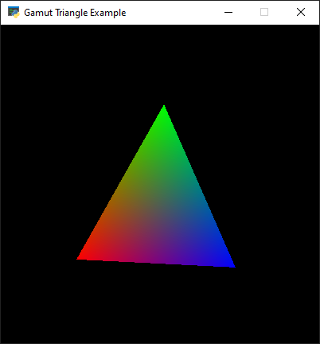
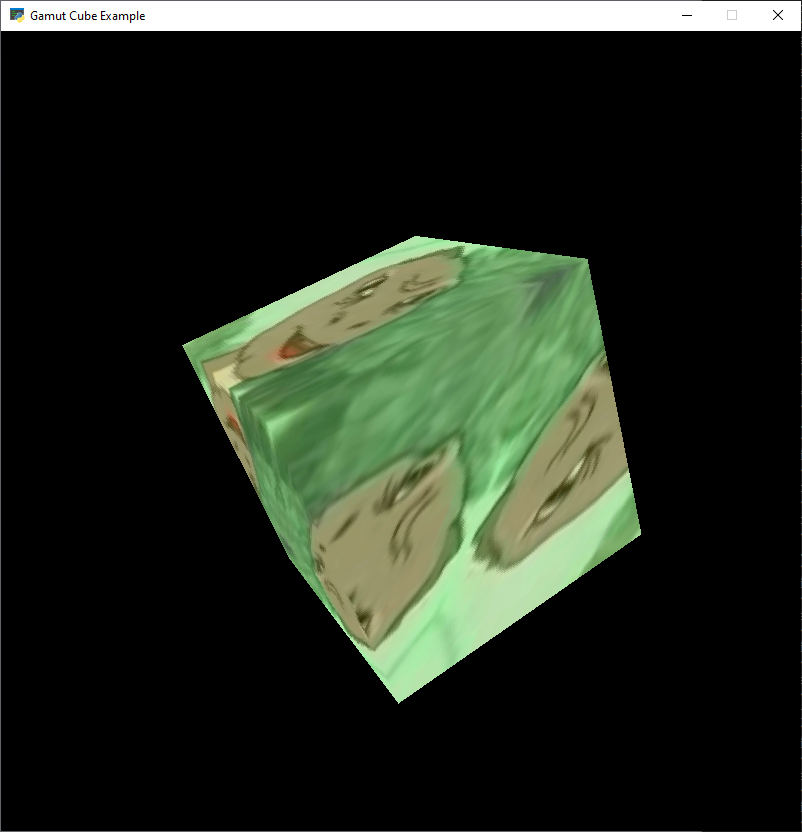
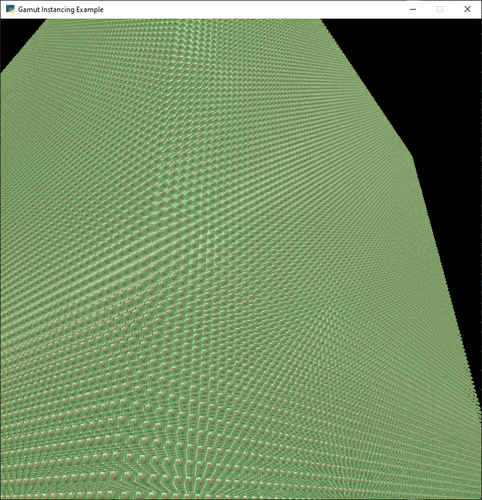
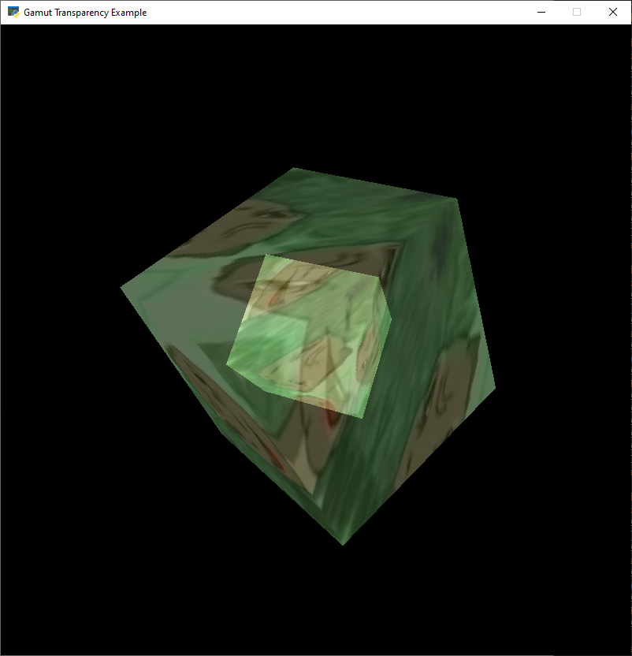
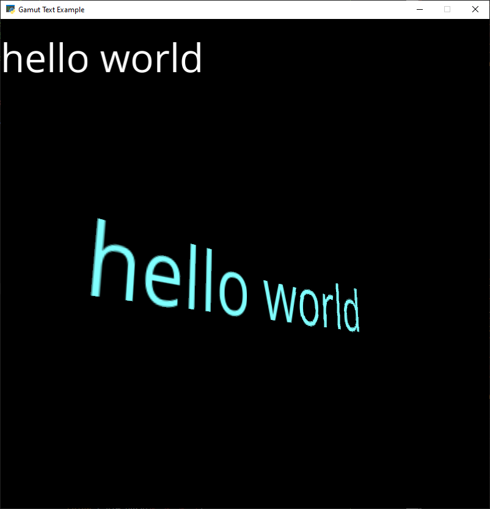
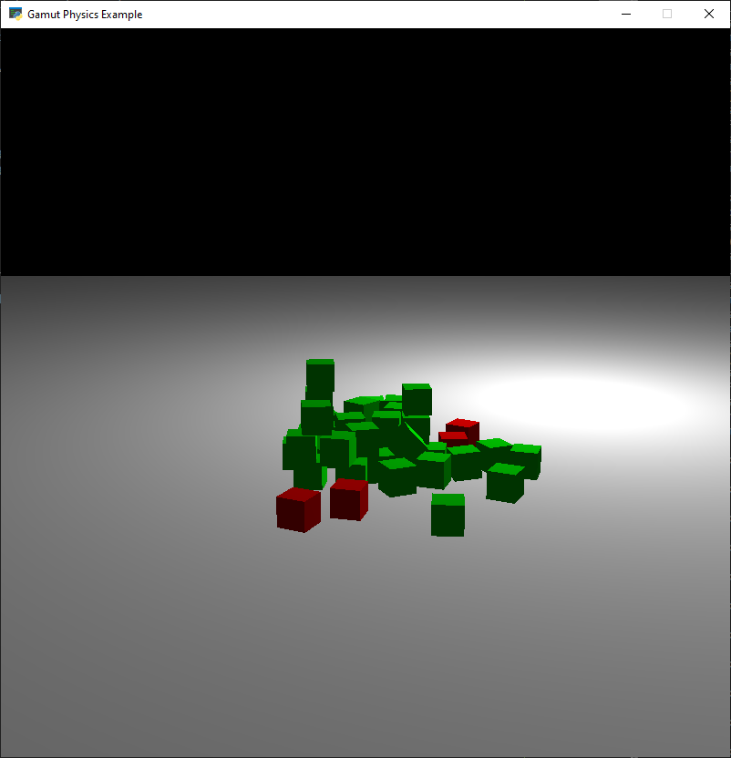
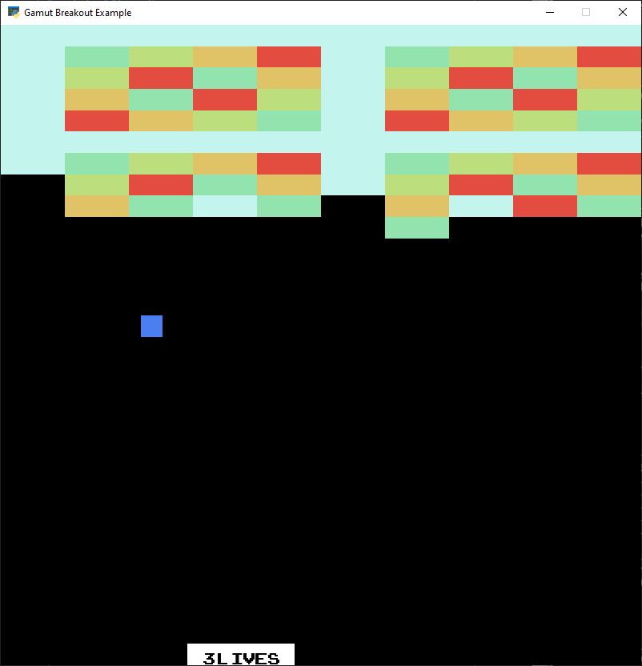
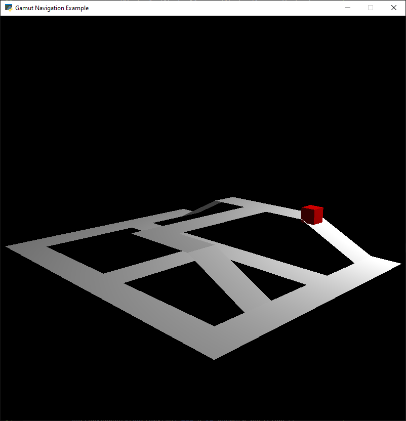

# Gamut Examples

## triangle.py
A very basic example of how to draw a colored rotating triangle to the screen.

## cube.py
Demonstrates rendering a rotating textured cube and moving the player's
perspective with the mouse and keyboard.

## instancing.py
Demonstrates rendering a million textured cubes using instanced rendering.

## transparency.py
Demonstrates rendering a transparent object.

## text.py
Demonstrates rendering text with both orthographic and perspective projections.

## physics.py
A very basic physics demo.

## breakout.py
A Breakout style game.

## navigation.py
Demonstration of pathfinding on a 3D mesh.

